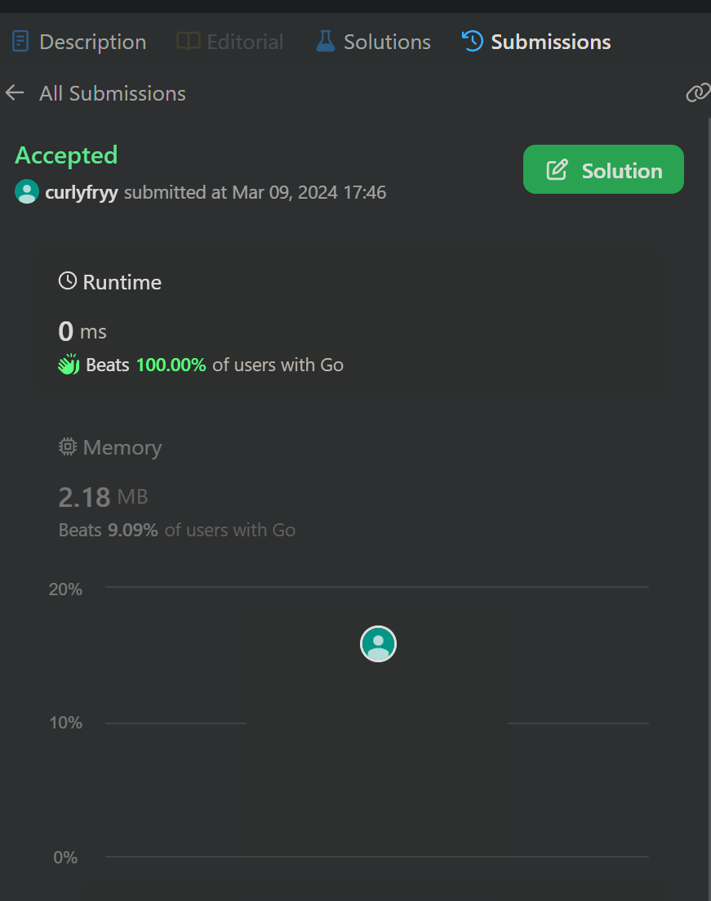
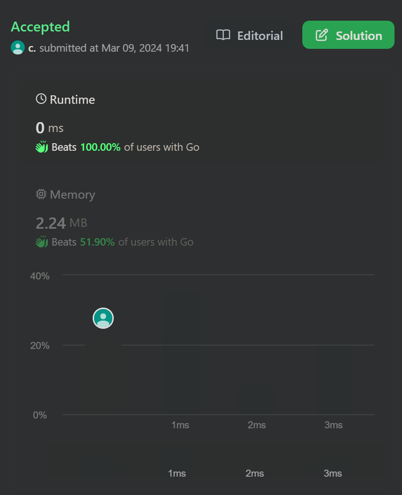
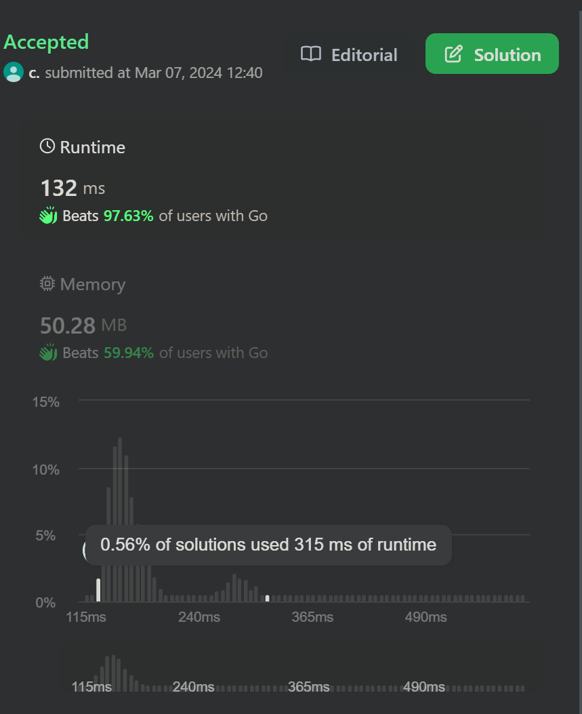

# LeetCode Top 150 Interview Problems

Top 150 LeetCode interview problems, including solutions and unit tests. Each folder contains a problem denoted by its ID.

## Notable
I am particularly proud of my solutions for the following problems. I achieved near 100th percentile in execution time on these, and have included a copy of the writeups I submitted to leetcode.com
- [388 - Longest Absolute File Path](388-longest-abs-file-path/writeup.md)

- [389 - Find the Difference](389-find-diff/writeup.md)

- [380 - Random Access Set](380-set/writeup.md)

